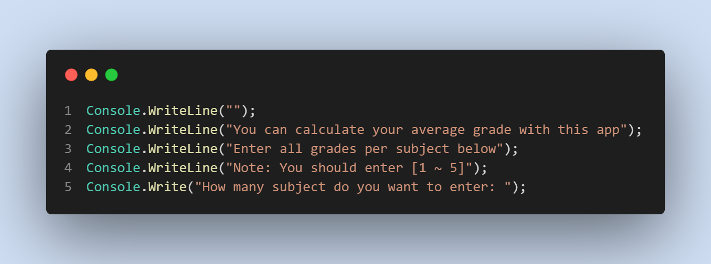
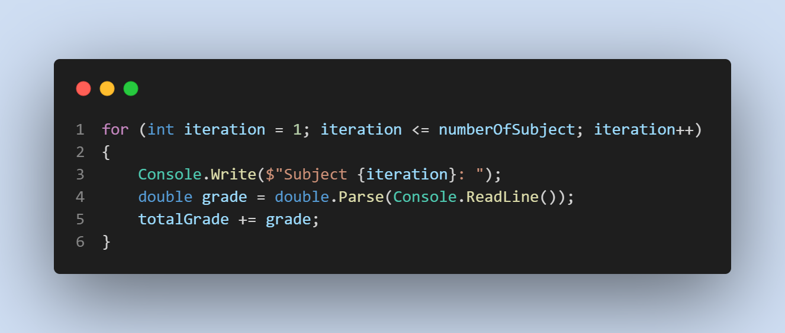
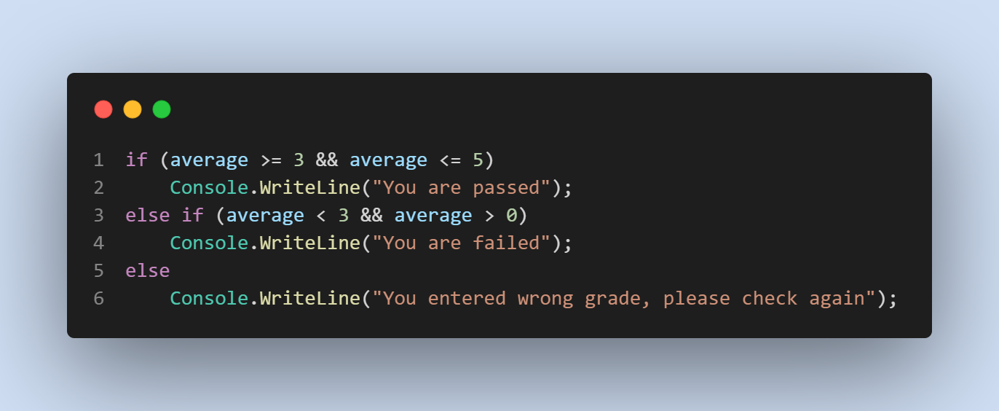
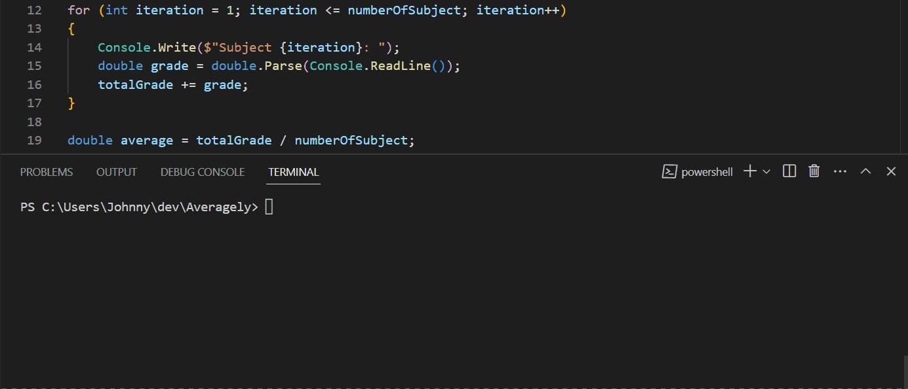

# Averagely

Usefull app for student who calculate average grade of subjects. Then app shows which you are pass & fail.

I have used basic functions and arithmetic operations:

* Console input/output

    

* Arithmetic operation inside `for` loop

    

* `If` statement

    

### Result:

If you want to run my code in your local computer, you can clone my code.

Click here for instruction **[video](https://www.loom.com/share/9cebefe04b8b40f0bb6c48f87f58ad59?sid=e90b647e-a46f-46e2-bca3-9f89aa2512f5)**

## Release Notes

### V1.0

We are excited to announce the release of version 1.0 of our Averagely App! This release introduces basic arithmetic calculations.

Features Added:

* You can calculate average score of your subjects.
  
### Path to Version 1.0

Click green word if you want to go **[Version 1.0](https://github.com/JohnnySenior/Averagely/tree/releases/v1.0)**

### V2.0

We are excited to announce the release of version 2.0 of our Averagely App! This release introduces basic arithmetic calculations.

Features Added:

* Bug fixes and other minor improvements.
* Add If expression.
* App show you which you are passed or fail.

### Path to Version 2.0

Click green word if you want to go **[Version 2.0](https://github.com/JohnnySenior/Averagely/tree/releases/v2.0)**

### V3.0

We are excited to announce the release of version 3.0 of our Averagely App! This is final and rich featured version.

Features Added:

* Bug fixes and other minor improvements.
* Add For Loop.
* App show you which you are passed or fail.
* You can choose how many subject calculate.

### Note: You are in **_Version 3.0_** now.
